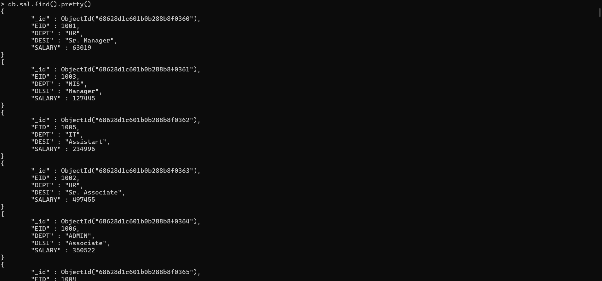
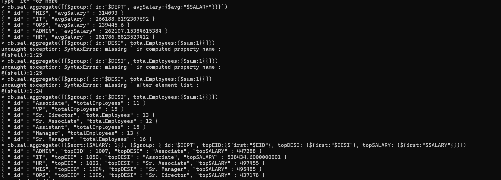
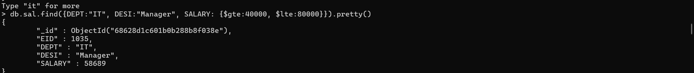
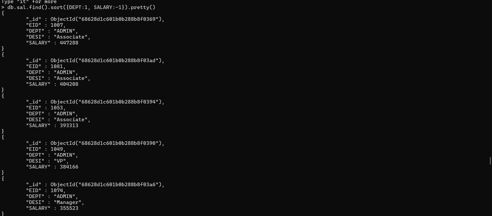
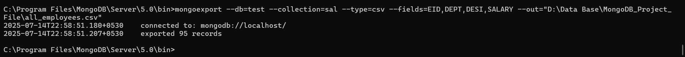
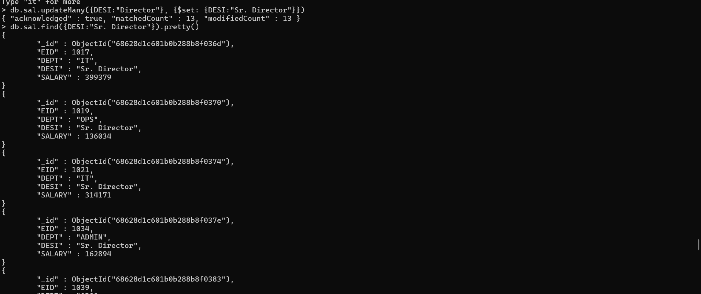

# 📘 MongoDB Employee Management System

This project demonstrates a shell-based **Employee Management System** using MongoDB with a focus on data queries, updates, aggregations, and CSV exports. It operates on a realistic employee dataset and replicates business-level data operations such as HR analytics and salary management.

> ⚡️ This is not just a NoSQL demo — it simulates real-world HR operations using MongoDB's powerful querying and aggregation tools.

---

## 🛠️ Tools Used

- **MongoDB Shell (v5.0)** – Data management and CLI operations  
- **MongoImport / MongoExport** – Dataset handling  
- **VS Code** – For managing `.js` query files  
- **GitHub** – Project documentation and version control

---

## 📌 Business Objective

To build a system that helps HR and leadership teams:

- View and filter employees by roles, salary, departments  
- Apply promotions and salary increments  
- Generate analytical reports such as avg salary or top-paid staff  
- Export departmental data for reporting

---

## 📊 Project Features

### 1️⃣ **Employee Data Queries**
- View all employee records  
- Filter by department, salary range, and designation  
- Sort by salary or department  

### 2️⃣ **Update Operations**
- Promote roles (e.g., Executive → Sr. Executive)  
- Apply salary hikes department-wise

### 3️⃣ **Aggregation Reports**
- Department-wise average salary  
- Total count by designation  
- Highest paid employee per department

### 4️⃣ **CSV Export**
- Filter and export employee data using `mongoexport`

---

## 🖼️ Screenshots

| 📄 View Queries | 📊 Aggregations |
|----------------|-----------------|
|  |  |
|  | |

| 📑 Sort & Update | 📤 Export |
|------------------|----------|
|  |  |
|  | |

---

## 🚀 How to Run the Project

1. Clone this repository:
   ```bash
   git clone https://github.com/Aniket-Roy-AR/mongodb-employee-management.git

2. Open CMD inside:
   ```bash
   mongodb-employee-management/

4. Import the dataset:
   ```bash
   mongoimport --db test --collection sal --type=csv --headerline --file=emp_sal.csv

6. Run commands using MongoDB Shell

7. Export filtered data using:
   ```bash
   mongoexport --db=test --collection=sal --type=csv --fields=EID,DEPT,DESI,SALARY --query="{\"DEPT\":\"HR\"}" --out="D:\Data Base\MongoDB_Project_File\hr_employees.csv"

